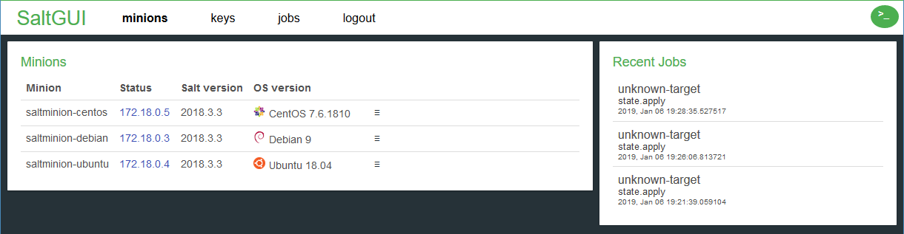
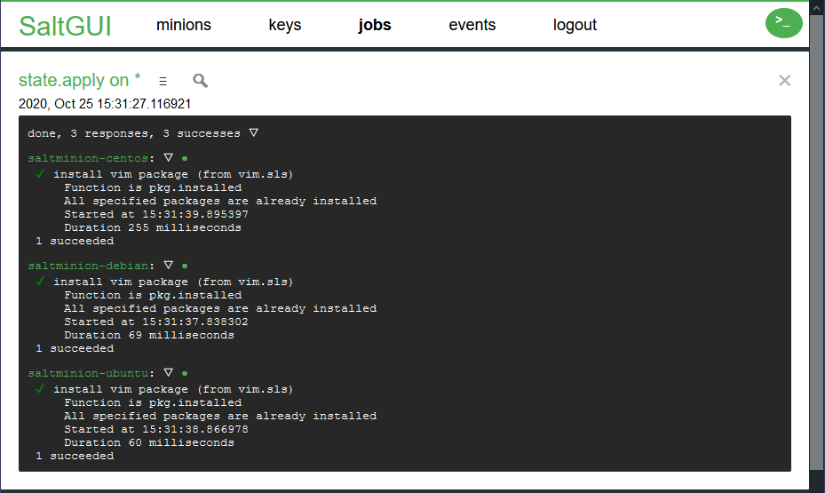

# SaltGUI

SaltGUI is an open source web interface for managing a SaltStack server and its minions. Built using vanilla ES6 and implemented as a wrapper around the rest_cherrypy server a.k.a. salt-api.

The version tagged `release` is the latest released version. The version `master` should be fine, but it may contain changes that are not yet in these release-notes.

See [SaltGUI documentation](https://erwindon.github.io/SaltGUI/) for the complete documentation.

IMPORTANT: since Salt version 3006, it is needed to add configuration option `netapi_enable_clients` to allow salt-api - and thus SaltGUI - to work. See also [netapi-enable-clients.html](https://docs.saltproject.io/en/3006.0/topics/netapi/netapi-enable-clients.html#netapi-enable-clients). Additionally, any Python
packages that the SaltStack installation also depends on, must be installed with `salt-pip`. This includes authentication plugins
such as `yubico_client`, or execution modules such as `boto3_sns`.


## Screenshots





## Features
- Simple setup without the need to add a database
- Login via PAM or any other supported authentication by Salt
- View minions and easily copy IPs
- Run state.highstate for a particular minion or all
- View the seven most recent jobs run on Salt
- Manually run any Salt function and see the output
- View highstate for all minions with details
- View issues for all minions with trivial solutions
- View the values for grains for a particular minion
- View the schedules for a particular minion
- View the values for pillars for a particular minion
- View the beacons for a particular minion
- View the live events on the salt-event bus
- View internal documentation for any salt command
- View external documentation for any salt command
- Define your own custom documentation for commands
- Match list of minions against reference list
- Match status of minions against reference list


## Quick start using PAM as authentication method
- Install `salt-api` - this is available in the Salt PPA package which should already been installed if you're using Salt
- Open the master config /etc/salt/master
- Find `external_auth` and configure as following (see the note below!):
```
external_auth:
    pam:
        saltuser1:
            - .*
            - '@runner'
            - '@wheel'
            - '@jobs'

# for SaltStack 3006 and higher
netapi_enable_clients:
    - local
    - local_async
    - runner
    - wheel
```
- See [Permissions](docs/PERMISSIONS.md) for more restricted security configurations.
- The username 'saltuser1' is only an example. Generic accounts are not recommended, use personal accounts instead. Or use a user-group, see [EAUTH](https://docs.saltproject.io/en/latest/topics/eauth/index.html) for details.
- Multiple entries like `saltuser1` can be added when you have multiple users.
- `saltuser1` is a unix (PAM) user, make sure it exists or create a new one.
- At the bottom of this file, also setup the rest_cherrypi server to access SaltGUI from "http://localhost:3333" (or on any of the hostnames that the server has):
```
rest_cherrypy:
    port: 3333
    host: 0.0.0.0
    disable_ssl: true
    app: /srv/saltgui/index.html
    static: /srv/saltgui/static
    static_path: /static
```
- Note that the cherrypi server is part of the salt-api package and has no separate installation. It is configured using the master configuration file. When configured using the above configurations, both the api calls and the html/js files are served by the cherrypy server. Therefore no additional web application server is needed.
- Note that from the SaltGUI GIT repository, only the directory `saltgui` forms the actual SaltGUI web application.
- Replace each of the `/srv/saltgui` in the above config with the actual `saltgui` directory from the GIT repository. Alternatively, you can create a soft-link /src/saltgui that points to the actual saltgui directory.
- Restart everything with ``pkill salt-master && pkill salt-api && salt-master -d && salt-api -d``
- You should be good to go. If you have any problems, open a GitHub issue. As always, SSL is recommended wherever possible but setup is beyond the scope of this guide.

**Note: With this configuration, the user has access to all salt modules available, maybe this is not what you want**

Please read [Permissions](docs/PERMISSIONS.md) for more information.


## Authentication
SaltGUI supports the following authentication methods supported by salt:
- pam
- file
- ldap
- mysql
- yubico

Since pam by itself is already very powerfull, that one is mentionned as standard.
By default, it provides access to the Linux password file.
When other authentication methods need to be used, their names can be added to file `saltgui/static/salt-auth.txt`.
There is one name per line in that file. Choose the authentication methods that are activated
in the salt-master configuration wisely, as the integrity of the salt-master and all salt-minions depends on it.

When a line `CLEAR` is present in the configuration file, then only the methods listed in the configuration file
are shown. When only one method is listed, the corresponding dropdown-box will not be visible on the login panel.
In that case, that method will always be used.

Note that SaltGUI cannot inspect the `master` file to see which authentication methods are actually in use.
This is because the salt-api can only read the file after login.

See the [EAUTH documentation](https://docs.saltstack.com/en/latest/topics/eauth/index.html) and the [Salt auth source code](https://github.com/saltstack/salt/tree/master/salt/auth) for more information.


## Command Box
SaltGUI supports entry of commands using the "command-box". Click on `>_` in the top right corner to open it.

Enter `salt-run` commands with the prefix `runners.`. e.g. `runners.jobs.last_run`. The target field can remain empty in that case as it is not used.

Enter `salt-call` commands with the prefix `wheel.`. e.g. `wheel.key.finger`. The target field will be added as named parameter `target`. But note that that parameter may not actually be used depending on the command.

Enter regular commands without special prefix. e.g. `test.ping`. The command is sent to the minions specified in the target field.

The text `##connected` in the target field will be immediatelly replaced by the list of connected
minions, or with `*` when all minions are connected, or with an expression when that is shorter.

Commands can be run normally, in which case the command runs to completion and shows the results. Alternatively, it can be started asynchronously, in which case only a bit of progress information is shown. When variable `state_events` is set to `true`, then the progress is shown per state when applicable. Batch commands are not supported at this time.

When executing commands, the setting for api-flag `full_return` is taken from option `saltgui_full_return` in salt master configuration file `/etc/salt/master`.
When set to `true`, this will result in some more information available in the execution result, e.g. the job-id.
This flag may (or may not) be applied to the internal commands that SaltGUI uses to show information.


## Output
SaltGUI shows the data that is returned by the Salt API.
Some variation can be achieved by modifying salt master configuration file `/etc/salt/master`.
e.g. (the default)
```
saltgui_output_formats: doc,saltguihighstate,json
```
`doc` allows reformatting of documentation output into more readable format. Also implies that only the result from one minion is used.
`saltguihighstate` allows reformatting of highstate data in a sorted and more readable format.
`json`, `yaml` and `nested` specify how all other output should be formatted. Only the first available of these formats is used.


## Time representation
The time formats used by Salt are very detailed and by default have 6 decimal digits to specify as accurate as nano-seconds. For most uses that is not needed. The fraction can be truncated to less digits by modifying salt master configuration file `/etc/salt/master`.
e.g.
```
saltgui_datetime_fraction_digits: 3
```
The value must be a number from 0 to 6.
Note that the effect is achieved by string truncation only. This is equivalent to always rounding downwards.

How the date and times that are shown can also be changed.
e.g.:

```
saltgui_datetime_representation: utc
```
The value must be `utc`, `local`, `utc-localtime` or `local-utctime`.
With `utc`, only the UTC date and time are shown.
With `local`, only the local date and time are shown. This includes an indication of the timezone.
With `utc-localtime`, the UTC date and time are shown. Additionally, the local time (not the local date) is shown.
With `local-utctime`, the local date and time are shown. Additionally, the UTC time (not the UTC date) is shown.
In all cases, a tooltip is added to a date+time field that shows the full representation of the date and time in both the local timezone and in UTC.

When using very old browsers, the required date/time functions may not be present. In that case SaltGUI reverts to simply displaying the reported time from the Salt system. The tooltip is then not shown.


## Templates
SaltGUI supports command templates for easier command entry into the command-box.
The menu item for that becomes visible there when you define one or more templates
in salt master configuration file `/etc/salt/master`.
The field `targettype` supports the values `glob`, `list`, `compound` and `nodegroup`.
Entries will be sorted in the GUI based on their key.
You can leave out any detail field.
e.g.:
```
saltgui_templates:
    template1:
        description: First template
        target: "*"
        command: test.fib num=10
    template2:
        description: Second template
        targettype: glob
        target: dev*
        command: test.version
```

When there are a lot of templates, they can be organized into categories.
e.g.:
```
saltgui_templates:
    template1:
        description: First template
        target: "*"
        command: test.fib num=10
        category: cat1
    template2:
        description: Second template
        targettype: glob
        target: dev*
        command: test.version
        categories:
            - cat1
            - cat2
```
When at least one template is assigned to a category, then you can select a template category before
selecting the actual category. Otherwise that choice remains hidden. Templates can be in multiple categories
when a list of categories is assigned.


## Jobs
SaltGUI shows a maximum of 7 jobs in on the right-hand-side of the screen.
SaltGUI shows a maximum of 50 jobs on the dedicated jobs page.
Commands that are used internally in SaltGUI are initially hidden.

On the Jobs page, more jobs can be made visible.
Select 'Show eligible jobs` to show all jobs that are not classified as internally-used jobs.
Select 'Show all jobs` to show all jobs that are known to salt.

Additional commands to hide can be configured
in salt master configuration file `/etc/salt/master`.
e.g.:
```
saltgui_hide_jobs:
    - test.ping
```

Commands that are normally hidden can be made visible using configuration
in salt master configuration file `/etc/salt/master`.
e.g.:
```
saltgui_show_jobs:
    - grains.items
```


## Grains
Selected grains can be previewed on the Grains page.
The names of these grains can be configured
in salt master configuration file `/etc/salt/master`.
e.g.:
```
saltgui_preview_grains:
    - "osrelease_info"
```
The names can be specified as simple names like the example above.
Alternatively, the [grains.get](https://docs.saltstack.com/en/latest/ref/modules/all/salt.modules.grains.html#salt.modules.grains.get) notation can be used to get more detailed information. The separator is always `:`. e.g. `locale_info:timezone`.
Alternatively, the [jsonpath](https://www.w3resource.com/JSON/JSONPath-with-JavaScript.php) notation can be used to allow even more freedom. Jsonpath is used when the text starts with a `$`. e.g. `$.ip4_interfaces.eth0[0]`.

In any table where the the minion status is shown and where the grain-values of the minion are also known, the minion status is
replaced with the the best value from grain `fqdn_ip4`.
The best value is chosen by first eliminating all values that appear for more than one minion.
Then the first value that has the most specific network prefix is used.
It is possible to chose a different grain by setting variable `saltgui_ipnumber_field` in salt master configuration file `/etc/salt/master`.
It is possible to restrict the eligible IP-numbers by setting variable `saltgui_ipnumber_prefix` in salt master configuration file `/etc/salt/master`. Only values with that string-prefix are considered.
The display of the IP-numbers can simply be disabled by choosing a non-existing grain or by choosing a non-existing prefix.

## Pillars
Pillars potentially contain security senstitive information.
Therefore their values are initially hidden.
Values become visible by clicking on them.
This behavior can be changed by adjusting the values of the configuration
in salt master configuration file `/etc/salt/master`.
The values for the pillar whose name match one of these regular expressions
are initially shown.
e.g.:
```
saltgui_public_pillars:
    - pub_.*
```

## Highstate
The Highstate page provides an overview of the minions and their latest state information.
At most 10 highstate jobs (`state.apply` or `state.highstate`) are considered.

Individual low-states can be re-tried by clicking on their state symbol.
Note that since the output of the `state.sls_id` commands is not considered in this overview,
the result of such action has no effect on this screen.
Use `state.apply test=true` to update the information without making changes on the minions.

For organisations where the 'saltenv' facility is used, it is possible to limit the jobs that are
considered to include (or exclude) only specific saltenvs.
e.g.:
```
saltgui_show_saltenvs:
    - base
```
or
```
saltgui_hide_saltenvs:
    - env2
    - env3
```
Typically only one of these variables should be set.
Jobs that were started without the `saltenv` parameter are, for this purpose only, assumed to use the value `default` for this parameter. This allows these jobs to be hidden/showed using the same mechanism. SaltGUI does not replicate the internal logic of the salt-master and/or the salt-minion to determine which saltenv would actually have been used for such jobs.

## Issues
The Issues page provides an overview of the system and reports any issues.
When no issues are found, the list remains empty.
The following issues may be reported:
* Disabled beacons, either individually disabled or on minion level
this should be solved by enabling or removing that beacon.
* Jobs that are still running after 60 seconds
this should be solved by terminating the job or just let it finish.
* Unaccepted keys
this should be solved by accepting or rejecting that key.
* Unconnected minions
this should be solved by fixing the minion, the minion's host or the connection to that host.
* Disabled schedules, either individually disabled or on minion level
this should be solved by enabling or removing that schedule.
* States that contain one or more failed tasks
this should be solved by retrying that state. Note that only all tasks of that state can be retried together.

Each issue has its own dropdown-menu, which typically contains:
* One or more salt-commands to fix the situation;
But note that there might be more possible solutions, some of which may actually be more preferred.
* A navigation-command to go to a page for more details.

## Custom command documentation
A custom HTML help text can be shown from the "Manual Run" overlay.

To use it,
- specify `saltgui_custom_command_help` in the salt master config. Example:
```
saltgui_custom_command_help: |
    <h2>Job Commands</h2>
        runners.jobs.active
        => Show active jobs

        runners.jobs.list_job «JID»
        => Show job with given job id (JID)
```
- Hover the documentation icon (`📖︎`) near the command input field and select `Show custom help`


## Message-of-the-day
A message-of-the-day (motd) can be added to the login screen.
It can be used for any information, e.g.:
- legal statement
- system identification
- useful links to other systems
- informing users about system availability
- etc.

The text is stored in file `saltgui/static/salt-motd.txt` or `saltgui/static/salt-motd.html`. The first must be pre-formatted text only. The second one can contain full HTML text. Both are shown when they are present. Note that the message should not contain sensitive data, as its content is shown before logging in.

Alternatively, or additionally, the text can be retrieved from the `master` file entries `saltgui_motd_txt` and `saltgui_motd_html`. These entries can contain sensitive information because its content can only be retrieved after login. But it is still recommended to not let the text contain any sensitive data.


## Multi master setup
When multiple salt-masters are in use in a multi-master setup, an installation of salt-api is needed per salt-master. And SaltGUI must have an installation per salt-api installation.
No specific extra configuration is needed for SaltGUI in this scenario.
But note that SaltGUI cannot bypass the restrictions that are implied by a multi-master setup.
e.g. each salt-master only holds the job history of the jobs that are initiated from that salt-master.
For multi-master setup, see also [Multi Master tutorial](https://docs.saltproject.io/en/latest/topics/tutorials/multimaster.html).


## Reduced menus
When apis are disabled using the native `external_auth` mechanism,
SaltGUI may show menu-items that have become unuseable.
In that case, it may be useful to reduce the menu-bar to less items.
Variable `saltgui_pages` is read from salt master configuration file `/etc/salt/master`.
It contains the list of accessible pages per user.
The first page in the list also becomes the landing page.
Users that are not listed still have the full menu.
e.g.:
```
saltgui_pages:
    user1:
        - keys
        - grains
```
Note that this is NOT a security mechanism to reduce what a user can do.
All pages are still accessible using their original deep-link.
And also any command can still be issued using the command-box.
For real security measures, use parameter `external_auth`.


## Performance
SaltGUI does not have artificial restrictions.
But displaying all data may be slow when there is a lot of data.
Most notorious is the display of a highstate with hundreds of minions, each with douzens of states.
SaltGUI can be forced to use a slightly simpler output by setting a parameter in salt master configuration file `/etc/salt/master`.
e.g.:
```
saltgui_tooltip_mode: simple
```
This parameter forces SaltGUI to use a very simple tooltip representation.
This is then the built-in version from the brower.
Typical effect is that it is shown slightly delayed and that is looks a bit primitive.
The only other allowed value is "none", with the effect that no tooltips are shown at all.


## Settings and statistics
By using ctrl-click on the SaltGUI logo in the top-left corner, an otherwise hidden page is made visible. The page shows the relevant settings from 3 categories on the left side and the api statistics on the right side.

First category contains the "session" details, which are the result of the login.
Second category contains the variables from the master file that are also relevant for SaltGUI.
The final category contains the variables that are specific to SaltGUI.
Simple variables with a limited range of values can be changed here for the duration of the current session. Permanent changes must be made in the master file.

The statistics panel is updated every 3 seconds.
Numeric fields that are known to contain timestamps are reformatted as readable strings.
Numeric fields that are known to contain durations are reformatted as readable strings.
Statistics for most threads that did not handle any requests yet are replaced by an empty string.
The amount of details shown depends on the parameter `collect_stats` in the `rest_cherrypy` block of the master file.


## Key administration
In situations like cloud hosting, hosts may be deleted or shutdown frequently.
But Salt remembers the key status from both.
SaltGUI can compare the list of keys against a reference list.
The reference list is maintained as a text file, one minion per line.
First column is the minion name.
Second column is `false` when the minion is known to be absent due to machine shutdown.
It should be `true` otherwise.
When the second column is missing, this validation is not performed.
Lines starting with `#` are comment lines.
The filename is `saltgui/static/minions.txt`.
Differences with this file are highlighted on the Keys page.
Minions that are unexpectedly down are highlighted on the Minions page.
When the file is absent or empty, no such validation is done.
It is suggested that the file is generated from a central source,
e.g. the Azure, AWS or similar cloud portals; or from a company asset management list.


## Separate SaltGUI host
In some specific environments you might not be able to serve SaltGUI directly from salt-api.
In that case you might want to configure a web server (for example NGINX) to serve SaltGui
and use it as proxy to salt-api so that requests are answered from the same origin from the browser point of view.

Sample NGINX configuration might look like this:
```
server {
    listen       80;
    server_name  _;
    root         /data/www;
    index        index.html;

    # handle internal api (proxy)
    location /api/ {
        proxy_set_header X-Real-IP $remote_addr;
        proxy_set_header X-Forwarded-For $proxy_add_x_forwarded_for;
        proxy_set_header X-NginX-Proxy true;
        proxy_pass http://saltmaster-local:3333/;
        proxy_ssl_session_reuse off;
        proxy_set_header Host $http_host;
        proxy_redirect off;
    }

    # handle saltgui web page
    location / {
        try_files $uri /index.html;
    }
}
```

The value of the `API_URL` in the `config.js` file must point to path where salt-api is exposed.
The value of the `NAV_URL` in the `config.js` file must point to path where the SaltGUI application is exposed.
```
const config = {
    API_URL: '/api',
    NAV_URL: '/app'
};
```
Note that the main page of SaltGUI is then located at `/app/`. When you want `/app` to work as well, you should instruct an intermediate proxy server to translate `/app` into `/app/`.

> Currently you can't use totally independent salt-api without proxy as support for CORS preflight request is not properly support.


## Development environment with Docker
To make life a bit easier for testing SaltGUI or setting up a local development environment you can use the provided docker-compose setup in this repository to run a saltmaster with three minions, including SaltGUI:
```
cd docker
docker-compose up
```
Then browse to [http://localhost:3333/](http://localhost:3333/), you can login with `salt:salt`.


## Testing
We provide some functional tests and unit tests. They use the docker setup to run the functional tests. You will also need [yarn](https://yarnpkg.com) and [node.js](https://nodejs.org/en/) to run them. When you have docker, yarn and node.js installed, you can run the tests from the root of the repository like this:
```
./runtests.sh
```

To show the browser window + a debugger while running the functional tests you can run:
```
NIGHTMARE_DEBUG=1 ./runtests.sh
```

We use the following testing libraries:
- [nightmare.js](https://github.com/segmentio/nightmare), for functional/browser tests
- [mocha](https://mochajs.org/), a well documented testing framework for javascript
- [chai](http://www.chaijs.com/), the preferred assertion library for testing

You'll need at least:
- `docker-compose` 1.12 or above
- `nodejs` 8.11 or above
- `yarn` 1.7 or above


## Known issues
At least in Chrome 96 and Edge 96, the "pause" icon is shown in its "emoji" form and appears in its coloured form. This also happens for the looking-glass icon in the search field.


## Contributing
Open a PR! Try to use no dependencies where possible, as vanilla JS is the aim. Any libraries will need to be heavily considered first. Please see the section above as PRs won't be reviewed if they don't pass the tests.


## Credits
This excellent frontend is originally written by [Oliver Dunk](https://github.com/oliverdunk).<br>
It was then further developed by [Martijn Jacobs](https://github.com/maerteijn).<br>
It is currently maintained by [Erwin Dondorp](https://github.com/erwindon).

SaltGUI includes these libraries (with possible modifications):
* [sorttable](https://www.kryogenix.org/code/browser/sorttable/)
* [search-highlight](https://www.the-art-of-web.com/javascript/search-highlight/)
* [jsonpath](https://www.w3resource.com/JSON/JSONPath-with-JavaScript.php)
