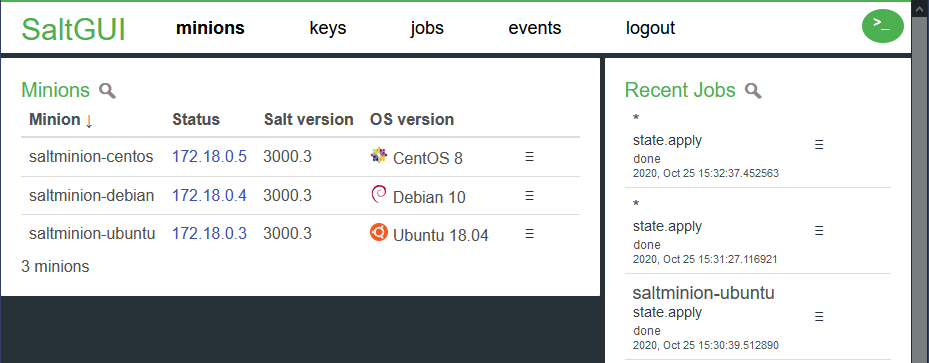
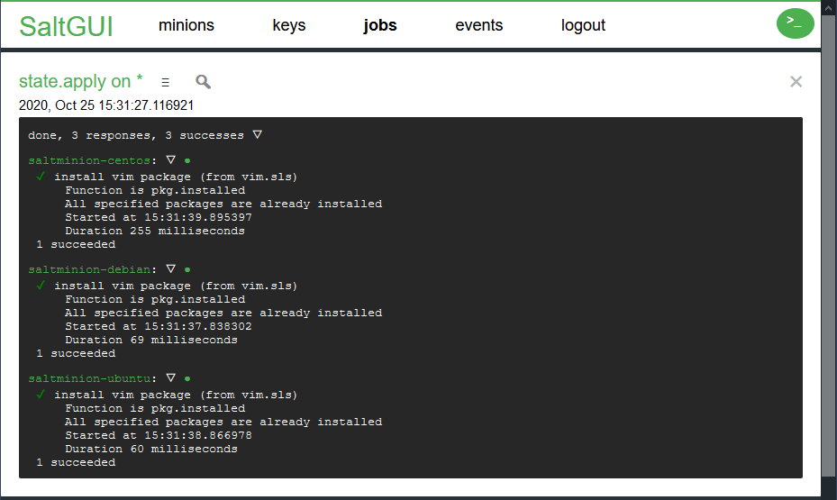

# SaltGUI

A new open source web interface for managing a SaltStack server. Built using vanilla ES6 and implemented as a wrapper around the rest_cherrypy server.

The version tagged `release` is the latest released version. The version `master` should be fine, but it may contain changes that are not yet in these release-notes.

## Screenshots

